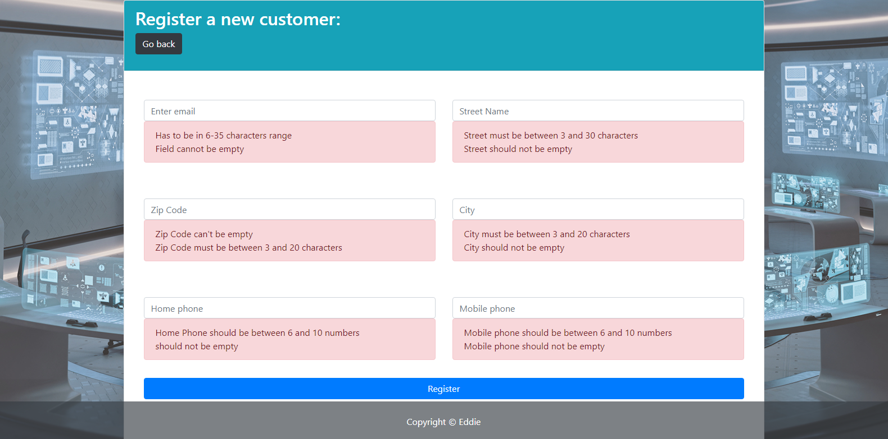
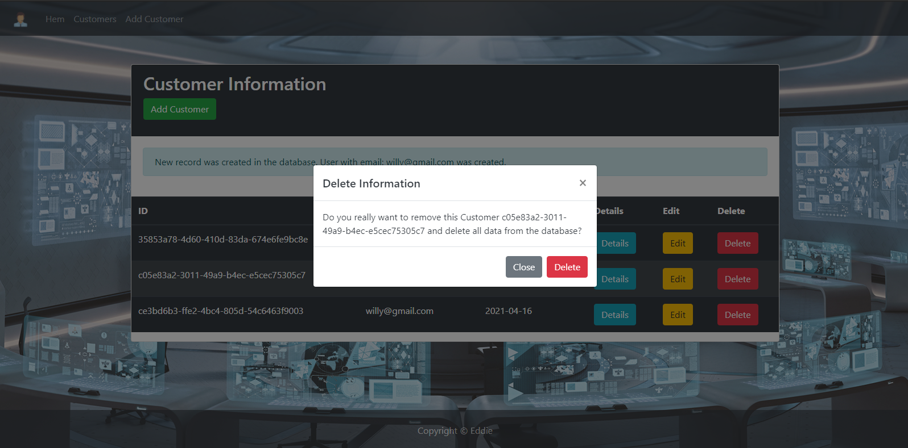

## Spring Boot Formbindning practice

### Project Dependencies

- Dev-tools
- Web
- Thymeleaf
- JPA-data
- MySQL
- H2

```xml

<dependencies>
    <!-- other dependencies -->

    <!-- bootstrap dependencies -->
    <dependency>
        <groupId>org.webjars</groupId>
        <artifactId>bootstrap</artifactId>
        <version>4.5.0</version>
    </dependency>

    <dependency>
        <groupId>org.webjars</groupId>
        <artifactId>webjars-locator</artifactId>
        <version>0.40</version>
    </dependency>

</dependencies>
```

#### Functionalities:
- CRUD Operations
- Validation for adding customers details


### Customers view


### Add customer details


### Validation


### View and remove record from the database
